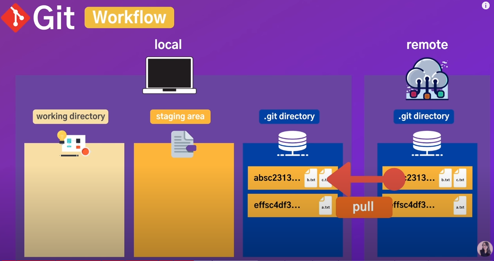

# Today I Learn

[TOC]

## 개요

SW 개발자로서 꾸준히 준비하고 싶다.

1일 1commit을 목표로 하루 하루 배운 것을 작성해 보겠다.

일지는 시간 역순으로 작성되어있고

CS 및 배움에 대한 정리를 h2와 TOC로 만들어 찾기 쉽게 만들어야겠다.

## Git

### Why Git?

함께 일하는 사람들이 버전 관리를 쉽게하기 위해

### Git 구조



### git 명령어

#### git 초기 설정

git에 대한 모든 설정 확인할 수 있음

```bash
git config --list
```

git 설정을 파일로 확인하고 싶다.

```bash
git config --global -e
```

현재 디렉토리에서 visualcode를 열고 싶다.

```bash
code .
```

git config --global -e 명령어를 수행하는 방법 2가지

```bash
# VScode로 열겠다.
git config --global core.editor "code"
# VScode로 열고 끝날때까지 terminal을 기다리게 한다.
git config --global core.editor "code --wait"
```

git 설정에 이름, 이메일 설정

```bash
git config --global user.name "Jake"
git config --global user.email "tkwk1205@naver.com"
git config user.name
Jake
git config user.email
tkwk1205@naver.com
```

새로운 줄바꿈 설정

```bash
git config --global core.autocrlf true
```

git 시작

```bash
git init
```

git 삭제

```bash
rm -rf .git
```

git 상태 확인

```bash
git status
```

git 단축키 설정

```bash
git config --global alias.st status
git st
```

git 명령어, 속성값 확인

```bash
git config --h
```

#### git add

디렉토리에 있는 모든 파일 추가

```bash
git add *
```

디렉토리에 있는 모든 파일들을 추가에서 git stagin area에 추가

```bash
git add .
```

git add 된 거 지우기

```bash
git rm --cahced -r .
```

특정 형식의 파일만 add

```bash
git add *.파일형식
```

#### git ignore

git ignore 파일 생성

```bash
echo *.log > .gitignore
```

#### git status

git status 에 대한 옵션을 더 확인 (help 옵션 추가)

```bash
git status -h
```

git status 를 단축어로 확인

```bash
git status -s
```

#### 파일 비교 diff

정확하게 어떤 파일의 내용이 수정되었는지 확인

```bash
git diff
git diff --staged
git diif -h
```

VScode를 이용해서 수정된 내용 확인하기

```bash
[diff]
    tool = vscode
[difftool "vscode"]
    cmd = code --wait --diff #LOCAL $REMOTE
```

```basg
git difftool
```

staging Area 에 있는 수정된 내용 확인하기

```bash
git difftoole --staged
```

#### git commit

commit 추가

```bash
git commit -m "커밋 메시지"
```

commit 내역 확인

```bash
git log
```

staging area와 working directory에 있는 모든 파일을 commit 메시지와 함께 commit

```bash
git commit -am "커밋 메시지"
```


### 그냥 명령어

디렉토리 만들기

```bash
mkdir 이름
```

폴더 이동

```bash
cd 폴더 이름
```

파일 확인

```bash
ls -al
```

`hello world!` 문장이 담긴`a.text` 파일 만들기

```bash
echo hello world! > a.text
```

파일 지우기

```bash
rm 파일 이름
```

파일 내용 확인

```bash
cat 파일 이름
```


## 일지

### 2020-11-23


### 2020-11-22

오늘 배운 거는 뭘까

오늘은 자소서를 2개 작성했는데 쉬울 거 같으면서 꽤 시간이 많이 걸렸다.

알고리즘을 매일 하나씩 풀려고 했는데 생각보다 시간이 많이 부족하네

취미를 줄이면서까지 해야할 거 같네. 과연 가능할 것인가. 해보자 그러기 위해서는 일찍 자고 일찍 일어나자


### 2020-11-21

1일 1commit의 중요성을 깨달은 것 같다. 꾸준히 하나씩 한다는 게 정말로 중요하다는 것을 깨달았다.

계속해서 노력하고 준비된 개발자가 되기위해 꾸준히 노력하겠다.