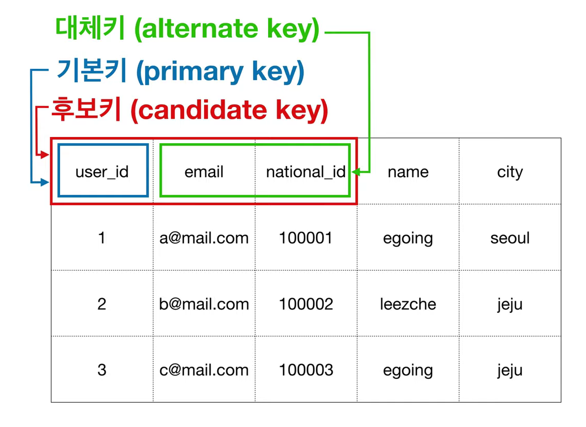
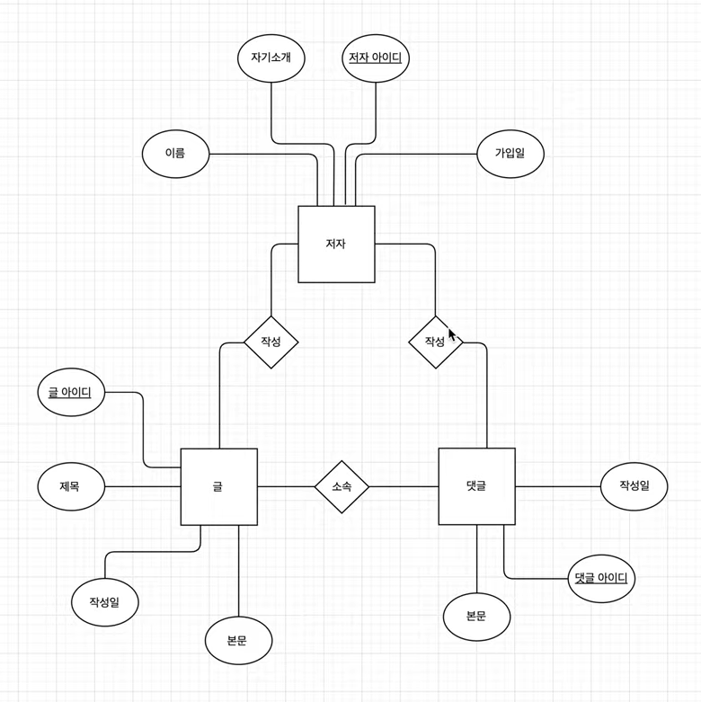
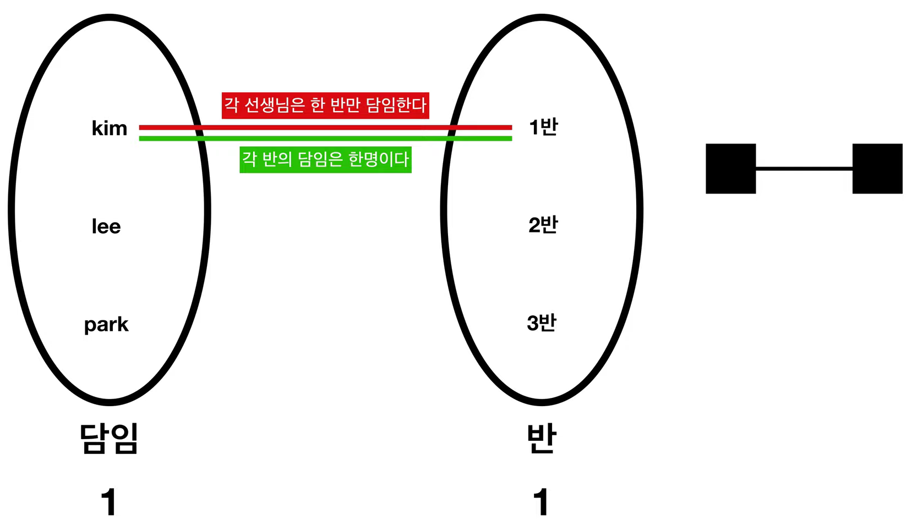
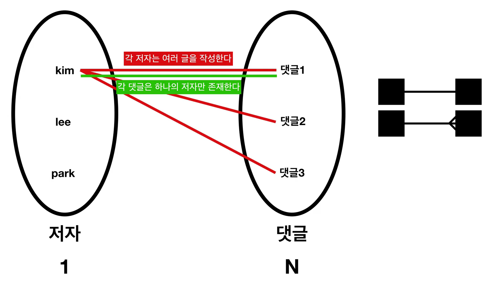
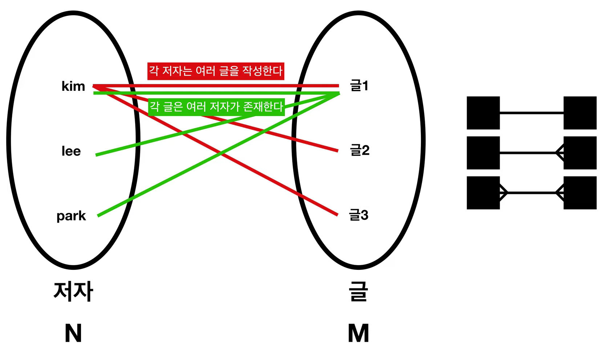
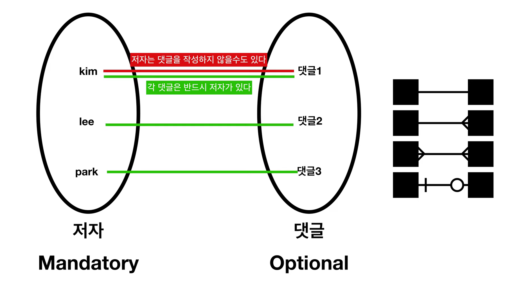
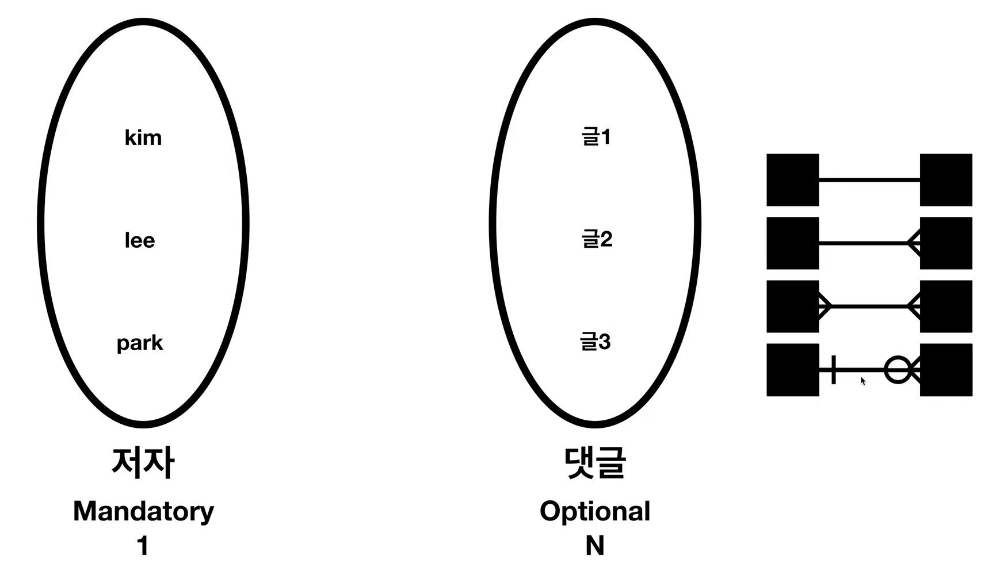

## SQL?

Structured

Query

Language


데이터를 다룰때 자주 사용되는 언어로

매우 쉽다는 특징이 있다.

## ERD

Entity Relationship Diagram

정보 - 그룹 - 관계

### 특징

1. 데이터를 그룹화할 수 있다.
2. 자원을 아낄 수 있다.  (그룹끼리 부를 수 있다.)
3. Join -> 필요할때마다 순간순간 합성할 수 있다.

Entity -> Table

Attribute -> Column

Relation -> PK, FK

Tuple -> Row


#### Identifier (식별자, PK)



#### Relationship (관계, 외래키, FK)



#### Cardinality (기수, 1:1, 1:N, N:M)







#### Optionality (1:1, 1:N, )





http://erd.yah.ac/

## 문법

### Select

```sql
SELECT * 		-- 사용하고 싶은 Column 이름을 작성
				-- *의 의미: all Clolumns
FROM movies;	-- 사용하고 싶은 Table 이름을 작성

SELECT name, genre, year
FROM movies;
```

### As

~~처럼

```sql
SELECT imdb_rating as "IMDb"	-- imdb_rating Column을 IMDb 라는 이름으로 바꿔서 사용
FROM movies;
```

### Distinct

중복 제외

```sql
SELECT DISTINCT tools	
FROM inventory;
--> tools
--> Hammer
--> Nails
--> Nails
SELECT tools
FROM inventory;
--> tools
--> Hammer
--> Nails
```

### Where

조건문, if 와 비슷하게 사용

`=`, `!=`, `>`, `<`, `>=`, `<=` 를 사용 가능

```sql
SELECT *
FROM movies
where year > 2014;
```

### Like

문자열 찾기

`_`: 모든 문자열

`%`: 앞 뒤로 모든 문자열

```sql
SELECT *
FROM movies
WHERE name LIKE 'Se_en';
--> Se7en
--> Seven
--> Se0en

SELECT *
FROM movies
WHERE name LIKE 'The %';	-- The 로 시작하는 영화 모든 것 검색
```

### Null

`IS NULL`: 비어있으면

`IS NOT NULL`: 비어있지 않으면

```sql
SELECT name
FROM movies
WHERE imdb_rating IS NULL;
```

### Between

사이

숫자, 문자 둘 다 가능

```sql
SELECT *
FROM movies
WHERE year BETWEEN 1970 AND 1979;	-- 1970, 1979 포함

SELECT *
FROM movies
WHERE name BETWEEN 'D' AND 'G';		-- D부터 G까지
```

### And

&&

```sql
SELECT *
FROM movies
WHERE genre =  "horror" 
AND year < 1985;
```

### Or

||

```sql
SELECT *
FROM movies
WHERE genre = 'romance'
OR genre = 'comedy';
```

### Order By

정렬 

오름 차순으로 Default

`ASC`: 오름차순

`DESC`: 내림차순

```sql
SELECT name, year, imdb_rating
FROm movies
ORDER BY imdb_rating DESC;
```

### Limit

제한

```sql
SELECT *
FROM movies
ORDER BY imdb_rating DESC
LIMIT 3 ;
```

### Case

이런 경우에는 이렇게 한다.

```sql
SELECT name,
 CASE
  WHEN imdb_rating > 8 THEN 'Fantastic'
  WHEN imdb_rating > 6 THEN 'Poorly Received'
  ELSE 'Avoid at All Costs'
 END
FROM movies;
-- Ice Age: The Meltdown	Chill
-- World War Z				Intense
```

### Count

개수를 센다

```sql
SELECT COUNT(*)
FROM fake_apps
WHERE price = '0.0';
```

### Sum

합

```sql
SELECT SUM(downloads)	-- dowmloads Column의 값 모두 합침
FROM fake_apps;
```

### Max, Min

최대, 최소

```sql
SELECT MAX(price)
FROM fake_apps;
```

### Average

평균

```sql
SELECT AVG(price)
FROM fake_apps;
```

### Round

소수점 개수

```sql
SELECT ROUND(AVG(price), 2)
FROM fake_apps;
```

### Group By

중복 제거, 특정 특징을 가진 Group을 원한다.

select에 포함이 있어야함

```sql
SELECT category, SUM(downloads)
FROM fake_apps
GROUP BY category;
```

```sql
SELECT category, price, AVG(downloads)
FROM fake_apps
GROUP BY category, price				-- 그룹을 여러개로 묶을 수 있다.
```

### Having

Where과 비슷하지만

Where는 row를 filter 하는 거지만

Having은 groups를 filter 하고 싶을때 사용

```sql
SELECT price, ROUND(avg(downloads)), COUNT(*)
FROM fake_apps
GROUP BY price
HAVING COUNT(*) > 10;
```

### Multiple Tables

한 곳에서 여러개 테이블 부를 수 있음.

```sql
SELECT *
FROM orders
LIMIT 5;
 
SELECT *
FROM subscriptions
LIMIT 5;
 
SELECT * 
FROM customers
LIMIT 5;
```

### Combining Tables (Join)

```sql
SELECT *
FROM orders						-- orders 테이블을 기준으로
JOIN subscriptions				-- subscriptions 를 삽입한다.
  ON orders.subscription_id = subscriptions.subscription_id;	-- 일치하는 내용은 이거
  
  
SELECT *
FROM orders
JOIN subscriptions
  ON orders.subscription_id = subscriptions.subscription_id
WHERE subscriptions.description = 'Fashion Magazine';
```

### Inner Joins

일치하는 내용이 있어야 합쳐진다.

없으면 삭제

```sql
SELECT COUNT(*)
FROM newspaper;

SELECT COUNT(*)
FROM online;

SELECT COUNT(*)
FROM newspaper
JOIN online
ON newspaper.id = online.id		
```

### Left Joins

일치하는 내용이 없어도 합쳐진다.

없는 내용은 `null` 값 삽입

```sql
SELECT *
FROM newspaper
LEFT JOIN online
ON newspaper.id = online.id;

SELECT *
FROM newspaper
LEFT JOIN online
ON newspaper.id = online.id
WHERE online.id IS NULL;
```

### Cross Join

모든 경우의 수 Cross로 합치기

티셔츠 2장 바지 3장의 코디 가능의 수 => 6가지

```sql
SELECT COUNT(*)
FROM newspaper
WHERE start_month <= 3 
AND end_month >= 3;

SELECT *
FROM newspaper
CROSS JOIN months;
```

### Union

column 값 같은 테이블 합치기

```sql
SELECT *
FROM newspaper 
UNION
SELECT *
FROM online
```

### With

Often times, we want to combine two tables, but one of the tables is the result of another calculation.

종종 우리는 두개의 테이블을 합치길 원하지만, 하나의 테이블은 하나의 테이블 계산의 결과이다.

```sql
WITH previous_query AS (
   SELECT customer_id,
      COUNT(subscription_id) AS 'subscriptions'
   FROM orders
   GROUP BY customer_id
)
SELECT customers.customer_name, 
   previous_query.subscriptions
FROM previous_query
JOIN customers
  ON previous_query.customer_id = customers.customer_id;
```

