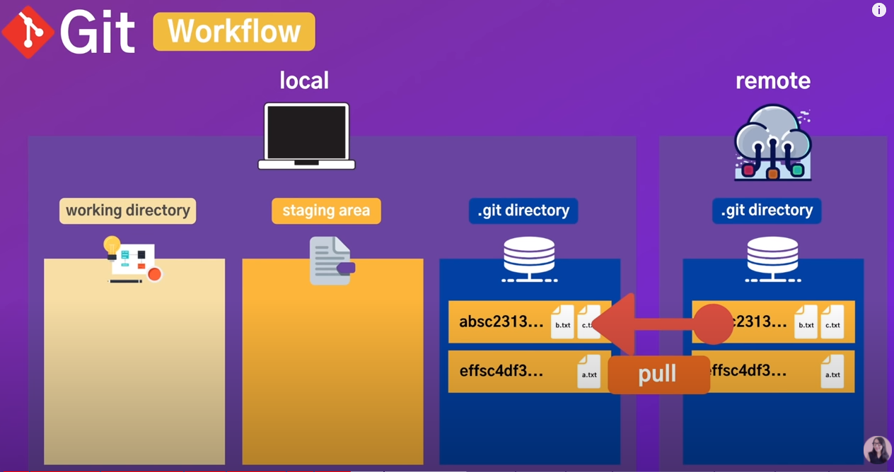

# Git

[TOC]

## Why Git?

함께 일하는 사람들이 버전 관리를 쉽게하기 위해

## Git 구조



## git 명령어

### Set up

#### Git Config

```bash
git config --list # git에 대한 모든 설정 확인할 수 있음
git config --global -e # git 설정을 파일로 확인하고 싶다.
code . # 현재 디렉토리에서 visualcode를 열고 싶다.
# git config --global -e 명령어를 수행하는 방법 2가지
git config --global core.editor "code" # VScode로 열겠다.
git config --global core.editor "code --wait" # VScode로 열고 끝날때까지 terminal을 기다리게 한다.
# git 설정에 이름, 이메일 설정
git config --global user.name "Jake"
git config --global user.email "tkwk1205@naver.com"
git config user.name
> Jake
git config user.email
> tkwk1205@naver.com
git config --global core.autocrlf true # 새로운 줄바꿈 설정 for Windows
# 단축키 설정
git config --global alias.co checkout
git config --global alias.br branch
git config --global alias.ci commit
git config --global alias.st status
```

#### Help

Git official site

https://git-scm.com/docs

```bash
git config --help #detail
git config --h #short
```

### Basic

#### Git init

```bash
git init # git 시작
rm -rf .git # git 삭제
```


#### Show the working tree status

```bash
git status # git 상태 확인
git status -h # git status 에 대한 옵션을 더 확인 (help 옵션 추가)
git status -s # git status 를 단축어로 확인
```


#### Ignoring Files

```bash
echo *.log > .gitignore # git ignore 파일 생성
# ignore all .a files
*.a
# but do track lib.a, even though you're ignoring .a files above
!lib.a
# only ignore the TODO file in the current directory, not subdir/TODO
/TODO
# ignore all files in any directory named build
build/
# ignore doc/notes.txt, but not doc/server/arch.txt
doc/*.txt
# ignore all .pdf files in the doc/ directory and any of its subdirectories
doc/**/*.pdf
```


#### Staging files

```bash
git add * # 디렉토리에 있는 모든 파일 추가
# stage all files except deleted files and files that begin with a dot
git add . # 디렉토리에 있는 모든 파일들을 추가에서 git stagin area에 추가
# stage everything
git add a.txt #stage a.txt file
git add a.txt b.txt #stage a.txt, b.txt files
git add *.txt #stage all files ends with .txt, 특정 형식의 파일만 add
```


#### Modifying files

##### Removing files

```bash
rm file.txt #delete file
git add file.txt #add to staging area
git rm file.txt # removes file from working directory and staging area
git rm --cached file.txt #removes from staging area only, git add 된 거 지우기
git clean -fd #removes all untracked files
```

##### Moving files

```bash
git mv from.txt to.txt
git mv from.text /logs/from.text
```


#### Viewing the Staged/Unstaged changes

```bash
git status #full status
git status -s #short status
# 파일 비교, 정확하게 어떤 파일의 내용이 수정되었는지 확인
git diff #changes in working directory
git diff --staged #changes in staging area
git diff --cached #same as --staged
```


#### Visual Diff Tool

##### Open .gitconfig and add below

VScode를 이용해서 수정된 내용 확인하기

```bash
[diff]
    tool = vscode
[difftool "vscode"]
    cmd = code --wait --diff #LOCAL $REMOTE
```

##### Run Git Diff tool

```bash
git difftool 
```

##### staging Area 에 있는 수정된 내용 확인하기

```bash
git difftoole --staged
```


#### Commit

```bash
git commit -m "커밋 메시지" # commit 추가
git commit -am "커밋 메시지" # staging area와 working directory에 있는 모든 파일을 commit 메시지와 함께 commit
```

##### commit 팁

1. commit 1, 2, 3 이런식으로 작성 X

2. 현재형 동사형으로 commit 메시지 작성 (Init, Add, Fix)

3. commit 메시지에 맞는 것만 작성 

   ex) Fix면 Fix만 작성해서 올려야지 Add 등 작성해서 한꺼번에 올리는 거 X
   
4. 어느정도 의미있는 단위로 나눠서 commit 하는 게

##### 파일 변경시 팁

rm -> git rm staging area 에 자동으로 포함

```bash
git rm 파일 이름
```

mv -> git mv staging area 에 자동으로 포함

```bash
git mv 파일 이름
```


#### Log & History

##### See history

```bash
git log # commit 내역 확인. 위에 있을수록 최신
git log -p # 수정된 파일의 내용도 확인
git log --state 
git log --oneline # 간단하게 한 줄로 보고 싶으면
git log --oneline --reverse # 거꾸로 보고 싶다면
```

##### Formatting

```bash
git log --pretty=oneline # git log --oneline 옵션을 풀어 쓴 거
git log --pretty=format:"%h %an %ar %s"	# commit 된 해쉬코드, 누가, date, 제목
git log --pretty=format:"%h %s" --graph	# format된 내역을 graph로 보기
git log --oneline --graph --all # commit 내역 전체를 graph로 보기
# git hist라 입력하면 git log 예쁘게 나오게하는 설정
git log --graph --all --pretty=format:'%C(yellow)[%ad]%C(reset) %C(green)[%h]%C(reset) | %C(white)%s %C(bold red){{%an}}%C(reset)
# 컴퓨터에 git 설정
git config --global alias.hist "log --graph --all --pretty=format:'%C(yellow)[%ad]%C(reset) %C(green)[%h]%C(reset) | %C(white)%s %C(bold red){{%an}}%C(reset) %C(blue)%d%C(reset)' --date=short"
```

##### Filtering

```bash
git log -3 # 최신 commit n 개를 보겠다.
git log --oneline -3 # 최신 commit n개를 한 줄로 보겠다.
git log --author="ellie" # commit 한 사람의 이름
git log --after="one week ago"
git log --grep="message" # commit 메시지 타이틀에서 포함된 것을 확인
git log -S "about" # 소스코드 컨텐츠 안에서 문자를 검색, 변경사항을 가지고 있는 log를 찾고 싶다면
git log -S "about" -p # 좀 더 상세하게 확인
```

##### History of a file

```bash
git log about.txt # 해당 파일에 해당하는 commit을 확인
git log -p about.txt # 좀 더 상세하게 확인
git log -s about.txt # 간단한 상태만 확인
```

##### HEAD & Hash code

```bash
git log HEAD # git log와 같은 동작
git log HEAD~1 # HEAD의 부모 요소 확인 (n번 째 앞 요소 확인)
```

##### Viewing a commit

```bash
git show hash # 해당하는 특정 commit 내용만 보고싶다, hash에 hash 코드 작성
git show hash:file.txt # hash 코드에 해당하는 commit에서 파일만 확인하고 싶다.
```

##### Comparing

```bash
git diff hash1 hash2 # 두개의 commit 내용을 비교
git diff hash1 hash2 file.txt # 두개의 commit의 file 을 비교
```


#### Tagging


##### Creating

```bash
git tag 문자열 # 문자열이라는 tag가 달림
git tag v1.0.0 hash # 해당 hash에 tag가 달림
git show v1.0.0 # 해당 hash 보여줌
git tag v1.0.1 -am "Release tag..." # 해당 태그에 메시지를 추가
```

##### Listing

```bash
git tag # tag 전체를 확인
git tag -l "v1.0.*" # tag 리스트 중 특정 문자를 포함한 것만 확인
```

##### Deleting

```bash
git tag -d v1.0.0 #delete the given tag
```

#####  Checking out Tags

```bash
git checkout v1.0.0 #checkout certain tag
# tag를 checkout 하면서 새로운  branch를 만들고 싶다
git checkout -b branchName v1.0.0 #create a new bracnh with the given tag 
```

##### Syncing with Remote

```bash
git push origin v1.0.0 #sharing the given tag with remote
git push origin --tags #sharing all the tags
git push origin --delete v1.0.0 #delete a remote tag 
```


## 그냥 명령어

디렉토리 만들기

```bash
mkdir 이름
```

폴더 이동

```bash
cd 폴더 이름
```

파일 확인

```bash
ls -al
```

`hello world!` 문장이 담긴`a.text` 파일 만들기

```bash
echo hello world! > a.text
```

파일 지우기

```bash
rm 파일 이름
```

파일 내용 확인

```bash
cat 파일 이름
```


